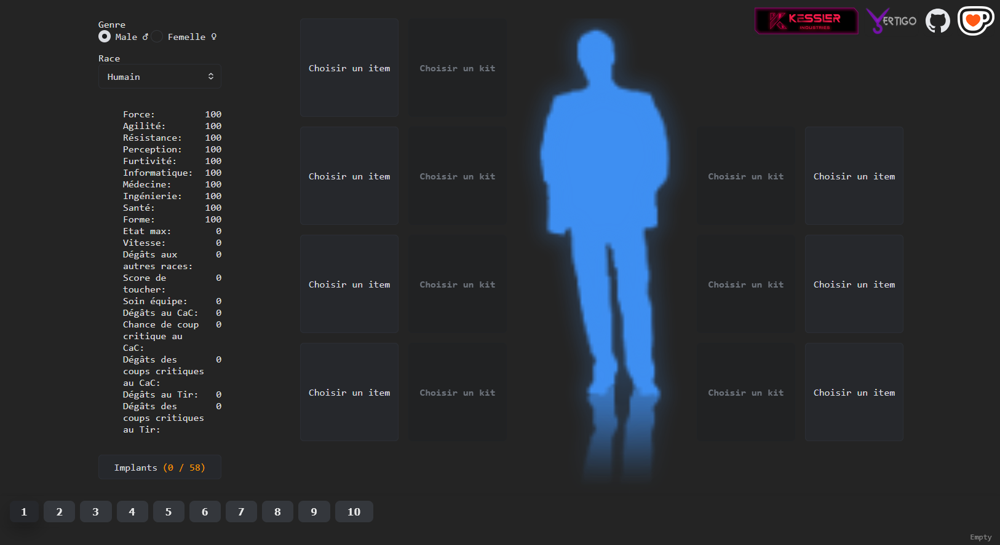
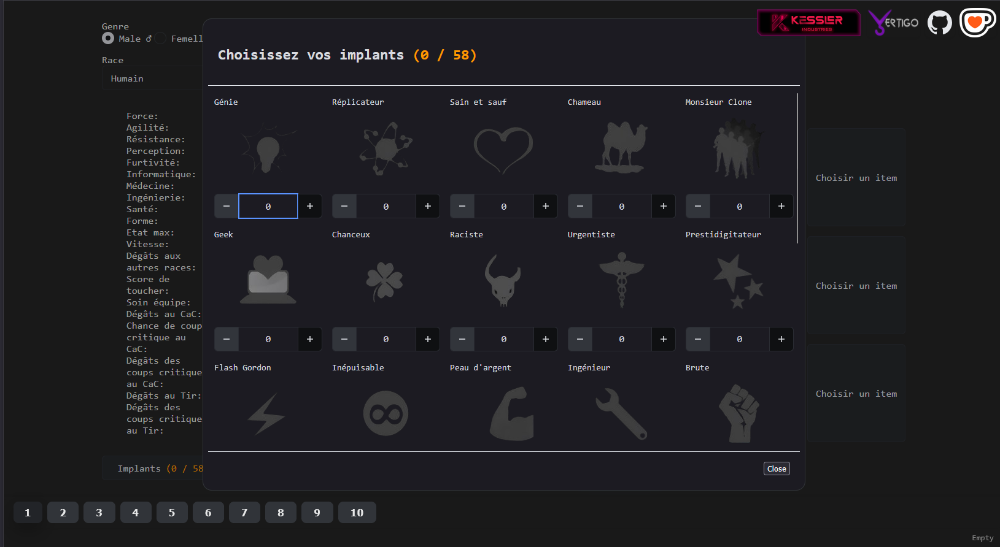
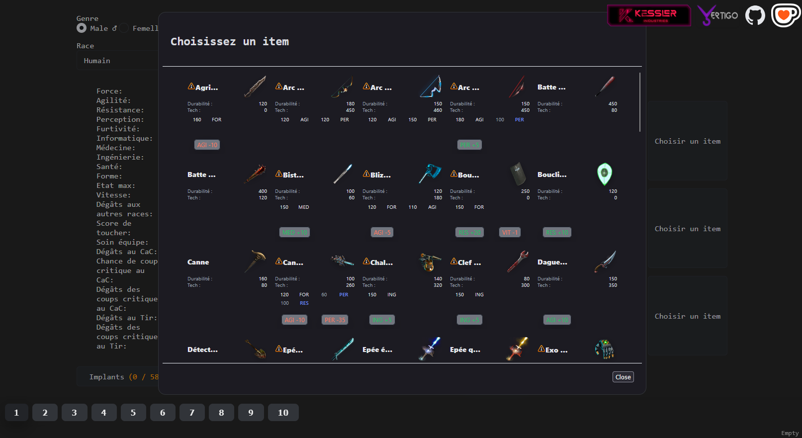
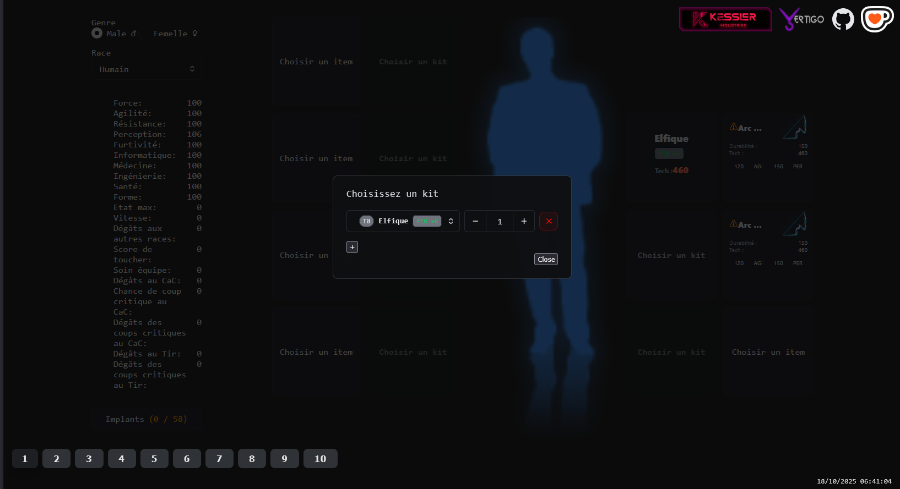

# Simulateur de Build Dreadcast

[](https://opensource.org/licenses/MIT)
[](https://dreadcast-simulator-kappa.vercel.app/)

Un outil de simulation pour créer et optimiser votre personnage sur [Dreadcast](https://dreadcast.net), le jeu de rôle cyberpunk francophone par navigateur.

## 🎮 Fonctionnalités

- **Création de personnage complète**

  - Choix du genre et de la race
  - Sélection des implants
  - Gestion de l'équipement et des kits
  - Calcul automatique des statistiques finales
  - Prise en compte des pré-requis

- **Sauvegarde**
  - Système de sauvegarde locale des builds
  - Possibilité de sauvegarder dix builds différents

## 📸 Captures d'écran






## 🚀 Utilisation

1. Sélectionnez votre genre et votre race
2. Ajustez vos implants via le bouton dédié
3. Équipez votre personnage avec l'équipement souhaité
4. Ajoutez des kits techniques si nécessaire
5. Consultez vos statistiques finales
6. Sauvegardez votre build pour le retrouver plus tard

## 💻 Technologies utilisées

- React + TypeScript
- Vite
- TanStack Router
- LocalStorage pour la persistance

## 🛠️ Installation locale

```bash
# Cloner le dépôt
git clone https://github.com/Isilin/dreadcast_simulator.git

# Aller dans le dossier du projet
cd dreadcast_simulator/frontend

# Installer les dépendances
yarn

# Lancer en mode développement
yarn dev

# Ouvrir la page web à http://localhost:5173
```

## 🌐 Accès en ligne

L'application est déployée et accessible à l'adresse suivante :  
[https://dreadcast-simulator-kappa.vercel.app/](https://dreadcast-simulator-kappa.vercel.app/)

## ❗ Notes importantes

- Ce simulateur est un projet communautaire non-officiel.
- Les données sont basées sur le jeu Dreadcast mais peuvent ne pas être totalement à jour.
- L'outil est pensé pour aider à la planification des builds, les statistiques en jeu peuvent varier.

## 🤝 Contribution

Les contributions sont les bienvenues ! N'hésitez pas à ouvrir une issue ou une pull request si vous souhaitez améliorer l'outil.

## ☕ Soutenir le projet

Si vous trouvez cet outil utile, vous pouvez soutenir son développement de plusieurs façons :

- **Ko-fi** : Vous pouvez m'offrir un café virtuel sur [Ko-fi](https://ko-fi.com/isilin).
- **In-game** : Vous pouvez également faire un don en ¢rédits à mon personnage _[Pelagia]_ sur Dreadcast. L'outil y est proposé de manière RP à tous les joueurs.

Chaque contribution aide à maintenir et améliorer l'outil !

## 🗺️ Roadmap

- [ ] Partager des builds
- [ ] Comparaison et suggestions de builds
- [ ] Mode sombre/clair
- [ ] Version mobile responsive
- [ ] Formules de stats avancées (encaissement, etc...)
- [ ] Bonus d'armes
- [ ] Mettre à jour les talents pour DCv4.14.10
- [ ] Prise en compte des drogues

## ❓ FAQ

**Q: Les statistiques sont-elles exactement les mêmes que dans le jeu ?**
R: Les calculs sont basés sur les formules connues, mais certaines variations peuvent exister.

**Q: Puis-je proposer des corrections ou des mises à jour ?**
R: Bien sûr ! Ouvrez une issue ou une PR sur GitHub.

## 📞 Contact

- Discord : [isilibn]
- MP Dreadcast : [Pelagia]
- GitHub : [@Isilin](https://github.com/Isilin)

## 📝 Licence

Ce projet est un projet amateur créé par la communauté Dreadcast. Il n'est pas affilié à l'administration officielle du jeu.
