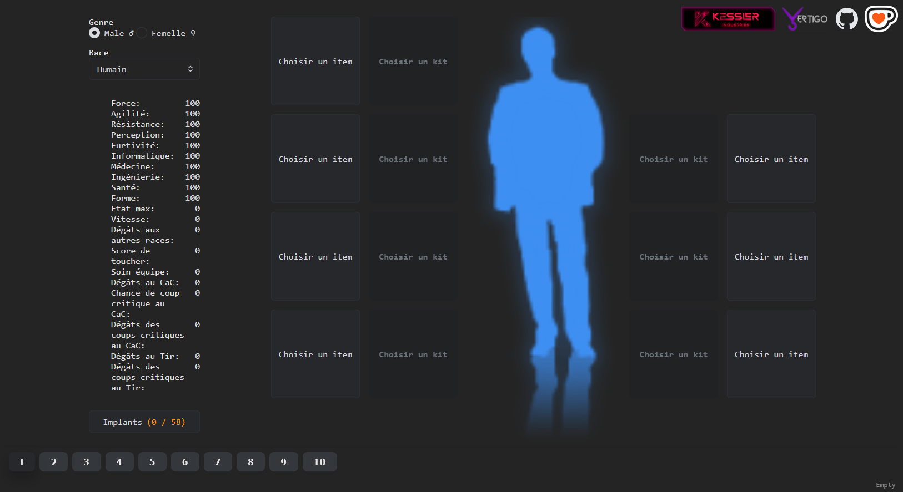
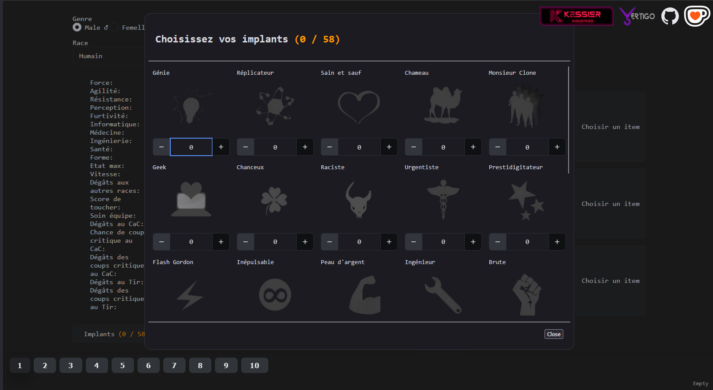
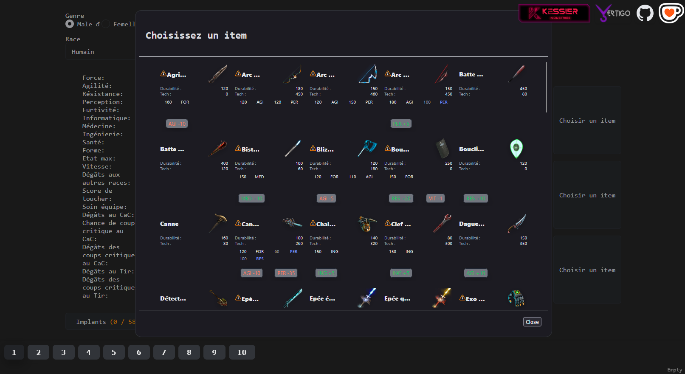
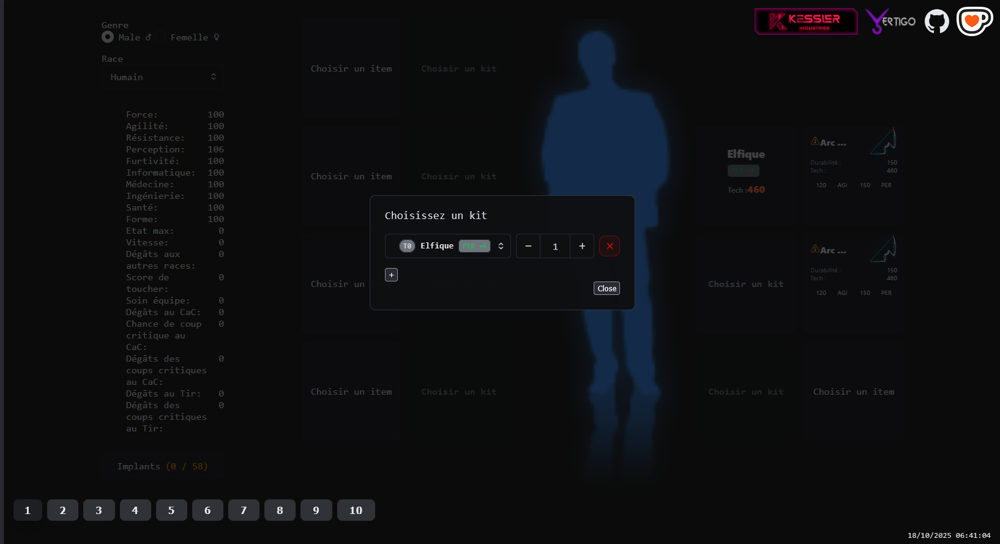

# Simulateur de Build Dreadcast


[](https://github.com/Isilin/dreadcast_simulator/actions)
[](https://github.com/Isilin/dreadcast_simulator/releases)
[](https://opensource.org/licenses/MIT)
[](https://dreadcast-simulator-kappa.vercel.app/)

⭐ Si vous aimez ce projet, mettez-lui une étoile sur GitHub !

[Vue d'ensemble](#vue-densemble) • [Fonctionnalités](#fonctionnalités) • [Démarrage rapide](#démarrage-rapide) • [Architecture](#architecture) • [Roadmap](#roadmap) • [FAQ](#faq)



Un simulateur complet pour créer et optimiser vos builds de personnage sur [Dreadcast](https://dreadcast.net), le jeu de rôle cyberpunk francophone par navigateur. Testez différentes combinaisons d'implants, d'équipements et de kits pour maximiser les statistiques de votre personnage.

> [!TIP]
> L'application est entièrement fonctionnelle en mode hors-ligne grâce au stockage local. Aucune connexion internet n'est requise après le chargement initial.

## Vue d'ensemble

Le Simulateur de Build Dreadcast permet aux joueurs de planifier leurs personnages en explorant différentes combinaisons d'équipements et d'augmentations cybernétiques. L'application calcule automatiquement les statistiques finales et gère les prérequis, offrant une expérience fluide pour optimiser vos builds.

  

Cette application est construite avec des technologies modernes et suit une architecture feature-sliced pour une maintenabilité optimale.

## Fonctionnalités

- **Création de personnage complète**
  - Sélection du genre et de la race avec impact sur les statistiques
  - Configuration des implants cybernétiques avec niveaux variables
  - Gestion de l'équipement complet (tête, torse, jambes, pieds, armes)
  - Ajout de kits techniques spécialisés
  - Calcul en temps réel des statistiques finales

- **Gestion des builds**
  - Sauvegarde locale de jusqu'à 10 builds différents
  - Import/export de configurations
  - Validation automatique des prérequis
  - Interface intuitive avec aperçu des modifications

- **Données du jeu**
  - Basé sur les mécaniques officielles de Dreadcast
  - Implants, équipements et kits à jour
  - Terminologie RPG authentique en français
  - Calculs de statistiques précis

## Démarrage rapide

### Option 1: Accès direct en ligne

Utilisez l'application directement depuis votre navigateur :

**[🚀 Ouvrir le Simulateur](https://dreadcast-simulator-kappa.vercel.app/)**

### Option 2: Installation locale

Clonez et exécutez le projet localement pour le développement :

```bash
# Cloner le dépôt
git clone https://github.com/Isilin/dreadcast_simulator.git

# Naviguer vers le projet
cd dreadcast_simulator/frontend

# Installer les dépendances
yarn install

# Démarrer le serveur de développement
yarn dev
```

Ouvrez [http://localhost:5173](http://localhost:5173) dans votre navigateur.

### Option 3: Environnement de développement

Pour les développeurs souhaitant contribuer :

```bash
# Installer toutes les dépendances
yarn install

# Lancer les vérifications qualité
yarn lint          # Vérification ESLint
yarn format        # Formatage Prettier
yarn build         # Build de production

# Démarrer avec rechargement automatique
yarn dev
```

## Architecture

### Stack technologique

- **Frontend**: React 19 + TypeScript pour une expérience utilisateur moderne
- **Routage**: TanStack Router pour la navigation côté client
- **Gestion d'état**: TanStack Query + Architecture reducer/context personnalisée
- **Styling**: CSS Modules avec variables CSS pour le theming
- **Build**: Vite pour des builds rapides et un développement fluide
- **Déploiement**: Vercel avec déploiement automatique

### Pattern architectural

Le projet suit une architecture **feature-sliced design** pour une organisation claire :

```text
src/
├── domain/          # Types partagés (Stat, ItemSpot, etc.)
├── feature/         # Fonctionnalités métier
│   ├── implant/     # Gestion des implants
│   ├── item/        # Gestion des équipements
│   ├── kit/         # Gestion des kits
│   └── profile/     # Profil du personnage
├── ui/              # Composants réutilisables
└── styles/          # Styles globaux et thème
```

Chaque fonctionnalité est organisée selon le pattern `model/services/ui` :

- **model**: Types, état et logique métier
- **services**: Récupération de données et intégrations
- **ui**: Composants React et interface utilisateur

### Gestion d'état

- **Pattern Reducer + Context** pour chaque fonctionnalité
- Séparation `StateContext`/`DispatchContext` pour les performances
- Persistance locale avec `localStorage`
- Validation avec schémas Zod

## Développement

### Scripts disponibles

```bash
yarn dev          # Serveur de développement (port 5173)
yarn build        # Build de production avec vérification TypeScript
yarn lint         # Vérification ESLint
yarn lint:fix     # Correction automatique des erreurs ESLint
yarn format       # Formatage avec Prettier
yarn preview      # Preview du build de production
```

### Standards de code

Le projet suit des standards stricts définis dans [CODING_STANDARDS.md](CODING_STANDARDS.md) :

- **TypeScript strict** avec pattern `as const` pour les énumérations
- **Feature-sliced design** avec exports barrel (`index.ts`)
- **CSS Modules** avec noms sémantiques
- **Hooks personnalisés** pour la logique réutilisable
- **Tests** avec React Testing Library (à implémenter)

### Configuration GitHub Copilot

Le projet inclut une configuration complète GitHub Copilot dans `.github/` :

- **Instructions** pour React, TypeScript, testing et sécurité
- **Prompts** pour la création de composants, tests et documentation
- **Agents** spécialisés (architecture, review, débogage)
- **Workflow** GitHub Actions pour validation continue

## Roadmap

### Version courante (v1.0)

- [x] Interface de base avec React 19
- [x] Gestion complète des implants
- [x] Système d'équipement et de kits
- [x] Sauvegarde locale de builds
- [x] Calcul automatique des statistiques

### Prochaines versions

#### v1.1 - Améliorations UX

- [x] Mode sombre/clair
- [ ] Version mobile responsive
- [ ] Animations et transitions fluides
- [x] Bonus d'armes

#### v1.2 - Fonctionnalités avancées

- [ ] Partage de builds via URL
- [ ] Comparaison de builds côte à côte
- [ ] Suggestions d'optimisation automatiques

#### v1.3 - Mécaniques avancées

- [ ] Formules de stats avancées (encaissement, etc.)
- [ ] Modificateurs complexes
- [ ] Support complet des drogues et effets temporaires

#### v2.0 - Backend et collaboration

- [ ] API backend pour persistance cloud
- [ ] Comptes utilisateurs et builds partagés
- [ ] Classements et builds de la communauté

## FAQ

**L'application fonctionne-t-elle hors-ligne ?**
Oui, une fois chargée, l'application fonctionne entièrement hors-ligne grâce au stockage local.

**Les statistiques sont-elles identiques au jeu ?**
Les calculs sont basés sur les formules officielles connues, mais de légères variations peuvent exister selon les mises à jour du jeu.

**Puis-je contribuer au projet ?**
Absolument ! Consultez [CODING_STANDARDS.md](CODING_STANDARDS.md) pour les conventions, puis ouvrez une issue ou une pull request.

**Le simulateur est-il officiel ?**
Non, c'est un projet communautaire non-officiel créé par des joueurs passionnés.

**Comment signaler un bug ?**
Ouvrez une [issue sur GitHub](https://github.com/Isilin/dreadcast_simulator/issues) avec une description détaillée du problème.

## Soutenir le projet

Si ce simulateur vous aide dans vos aventures cyberpunk :

- **⭐ Mettez une étoile** au projet sur GitHub
- **🐛 Signalez les bugs** via les issues GitHub
- **💡 Proposez des améliorations** avec vos idées
- **☕ Offrez un café** sur [Ko-fi](https://ko-fi.com/isilin)
- **🎮 Don en jeu** à [Pelagia] sur Dreadcast

## Contact et communauté

- **Discord**: [isilibn]
- **GitHub**: [@Isilin](https://github.com/Isilin)
- **Dreadcast**: [Pelagia]

---

> **Note légale**: Ce projet est un outil communautaire non-officiel. Il n'est pas affilié à l'administration du jeu Dreadcast. Toutes les données du jeu appartiennent à leurs propriétaires respectifs.
