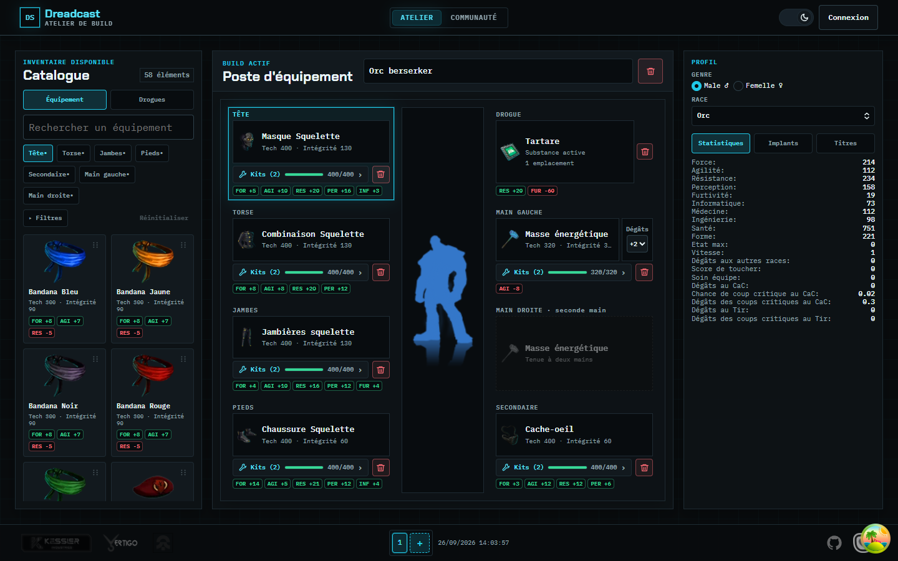
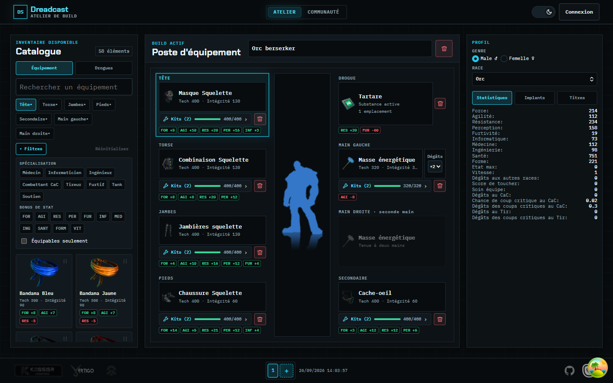
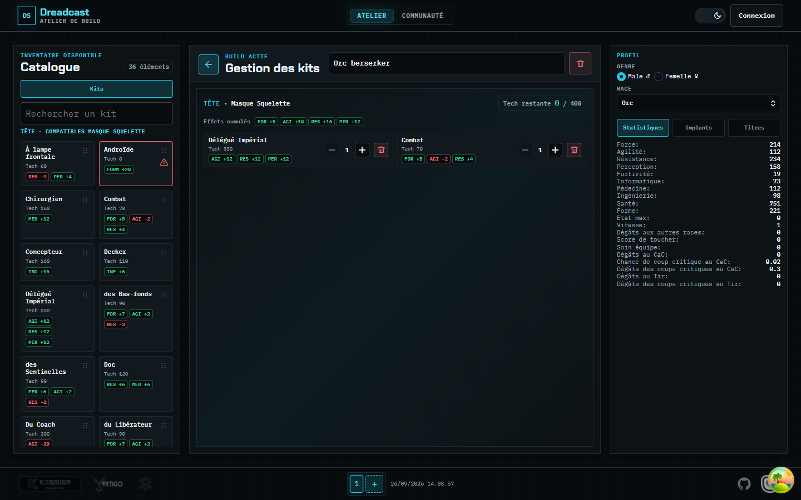
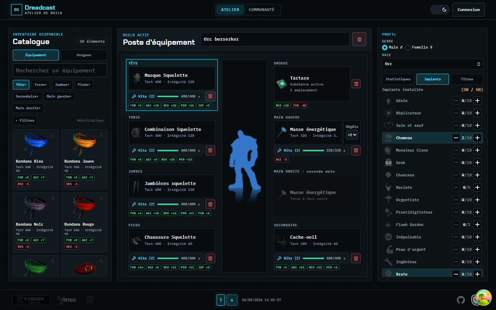
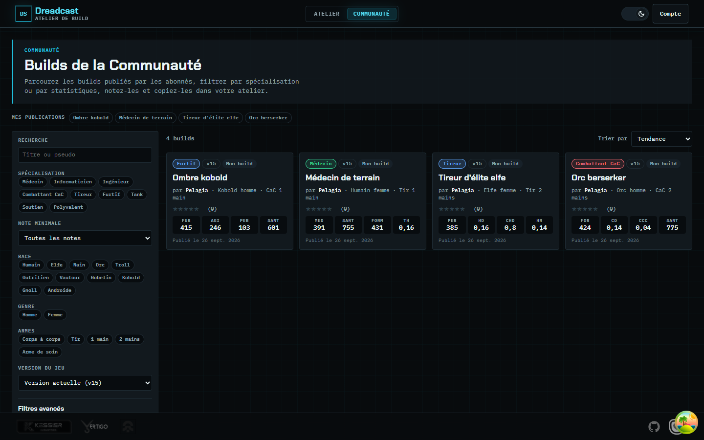
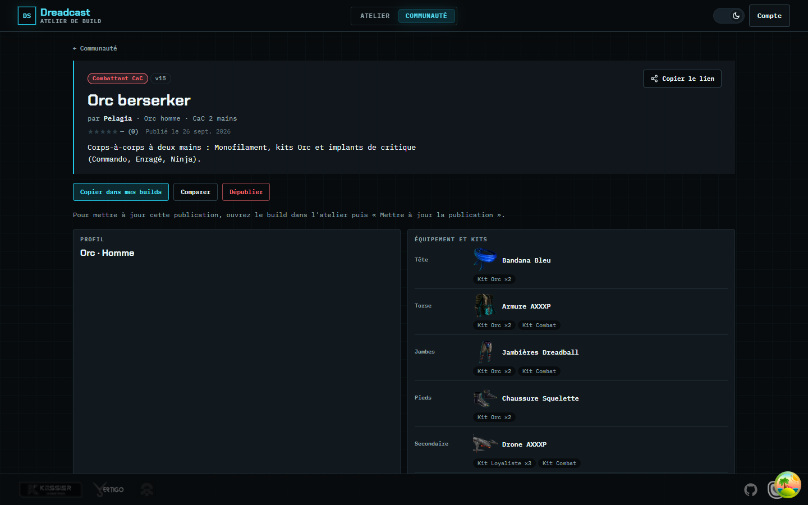

# Simulateur de Build Dreadcast

Préparez votre personnage de [Dreadcast](https://dreadcast.net), le jeu de rôle cyberpunk francophone par navigateur, avant de dépenser le moindre crédit : équipez-le, ajoutez kits, implants et drogue, et voyez ses statistiques évoluer en direct.

**[🚀 Ouvrir le simulateur](https://dreadcast-simulator-kappa.vercel.app/)**

## L'atelier

Tout se passe sur un seul écran : le catalogue à gauche, le personnage au centre, son profil et ses statistiques à droite.

- **Profil** : choisissez le genre et la race, qui fixent les statistiques de départ.
- **Équipement** : tête, torse, jambes, pieds, accessoire secondaire et armes. Glissez un objet du catalogue sur son emplacement ; une arme à deux mains occupe les deux bras. Chaque arme peut recevoir son bonus de dégâts (+0 à +5).
- **Catalogue** : recherche par nom, filtres par emplacement, par spécialisation (médecin, tireur, tank…), par bonus de statistique, ou seulement ce que votre personnage peut porter.
- **Kits** : ajoutez des kits sur chaque équipement dans la limite de sa technologie, avec la jauge de tech restante et les effets cumulés.
- **Implants** : réglez le niveau de chaque implant, dans la limite du nombre d'implants installables.
- **Drogue** : activez une drogue et ses effets secondaires.
- **Titres** : cochez les titres débloqués par votre personnage.
- **Prérequis** : un objet ou un kit dont les conditions ne sont pas remplies (statistiques, titre, implant, race) est signalé.
- **Statistiques** : force, agilité, résistance, santé, dégâts, chances de critique… recalculées à chaque modification.

| Catalogue et filtres                                   | Gestion des kits                              | Implants                                        |
| ------------------------------------------------------ | --------------------------------------------- | ----------------------------------------------- |
|  |  |  |

## Vos builds

- **Sans compte** : un build, conservé dans votre navigateur.
- **Avec un compte** : jusqu'à 5 builds, retrouvés sur tous vos appareils, à nommer et supprimer à volonté.
- **Avec un abonnement** : builds illimités. À la fin de l'abonnement, les builds au-delà de 5 sont conservés mais masqués.

Chaque modification est enregistrée automatiquement.

## La Communauté

- **Publier** : les abonnés publient une copie figée de leur build, signée de leur pseudo, avec une spécialisation détectée d'après les statistiques (modifiable).
- **Chercher** : filtres par spécialisation, note, race, genre, armes et version du jeu ; pour les abonnés, seuils de statistiques, implants, drogue, équipement précis et favoris. Tri par tendance, note, nouveauté, nombre d'avis ou dernière mise à jour.
- **Consulter** : fiche complète du build (équipement, kits, implants, statistiques), avec note de 1 à 5 étoiles et avis courts.
- **Réutiliser** : copier un build dans votre atelier, le mettre en favori, le comparer à l'un de vos builds.
- **Découvrir** : recommandations « Pour vous » et « Builds proches du mien ».
- **Partager** : chaque publication a son lien ; les visiteurs sans compte en voient un aperçu.

Les membres connectés sans abonnement parcourent la liste en aperçu ; le détail, les filtres avancés, les notes et la copie sont réservés aux abonnés.

## Abonnements

Plusieurs durées d'abonnement (en années de jeu, ou illimité) sont proposées depuis le menu du compte. Chaque demande est validée par un administrateur.

## FAQ

**Les statistiques sont-elles identiques au jeu ?**
Les calculs reprennent les formules connues du jeu ; de légers écarts peuvent apparaître après une mise à jour de Dreadcast.

**Le simulateur est-il officiel ?**
Non, c'est un projet communautaire créé par des joueurs.

**Comment signaler un bug ou proposer une idée ?**
Ouvrez une [issue sur GitHub](https://github.com/Isilin/dreadcast_simulator/issues).

## Soutenir le projet

- ⭐ Mettez une étoile au projet sur GitHub
- ☕ Offrez un café sur [Ko-fi](https://ko-fi.com/isilin)
- 🎮 Faites un don en jeu à Pelagia sur Dreadcast

## Contact

- **Discord** : isilibn
- **GitHub** : [@Isilin](https://github.com/Isilin)
- **Dreadcast** : Pelagia

Vous voulez contribuer au code ? Le guide technique est dans [FRONTEND_README.md](FRONTEND_README.md).

---

> **Note légale** : ce projet est un outil communautaire non officiel, sans lien avec l'administration de Dreadcast. Les données du jeu appartiennent à leurs propriétaires respectifs.
